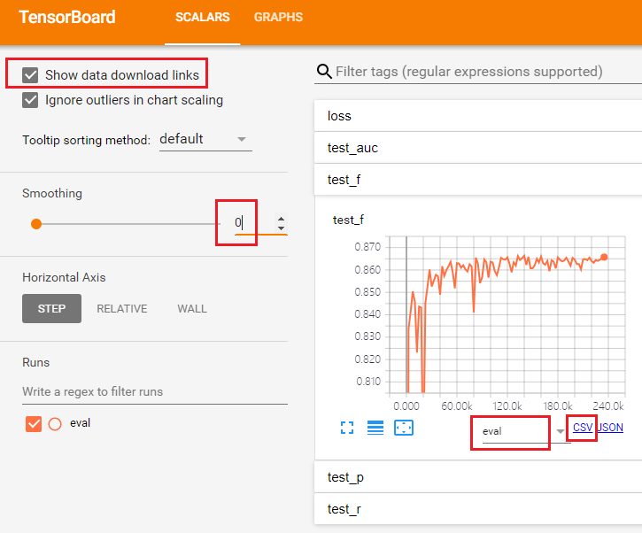
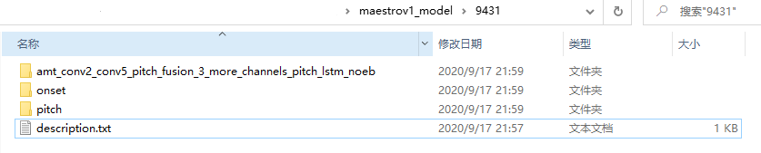

# AMT调参

[TOC]
## 当前模型精度

```
/home/data/wangxianke/lstm_model/onset_lstm_11/model.ckpt-140000,/home/data/wangxianke/lstm_model/pitch_noeb_no_loss_weight/model.ckpt-34000
```

<div>
<table class="table">
    <style type="text/css"> table {text-align:center} </style>
    <tr>
        <th rowspan=2></th>
        <th colspan=3>train</th>
        <th colspan=3>eval</th>
    </tr>
    <tr>
        <th>P</th>
        <th>R</th>
        <th>F1</th>
        <th>P</th>
        <th>R</th>
        <th>F1</th>
	</tr>
    <tr>
        <th>onset</th>
        <td>93.30</td>
        <td>90.63</td>
        <td>91.95</td>
        <td>86.71</td>
        <td>86.56</td>
        <td>86.64</td>
    </tr>
    <tr>
        <th>pitch</th>
        <td>91.12</td>
        <td>88.15</td>
        <td>89.61</td>
        <td>89.99</td>
        <td>85.46 </td>
        <td>87.67</td>
    </tr>
    <tr>
        <th>union</th>
        <td colspan=2>P=0.9724</td>
        <td colspan=2>R=0.9314</td>
        <td colspan=2>F1=0.9511</td>
    </tr>
</table>
</div>


## 当前模型超参数

### 帧级超参数

|       | conv_reg2 | conv_reg2 | pos_weight |
| ----- | --------- | --------- | ---------- |
| onset | 0.0       | 1e-4      | None       |
| pitch | 5e-3      | 0.0       | None       |

### 后处理参数

| 参数          | 值   |
| ------------- | ---- |
| onset_thrd    | 0.5  |
| pitch_thrd    | 0.6  |
| adjacent_time | 0.05 |


## 需要测试的参数

- 正样本权重

  1. 设置的位置在**glovar.py**的**pos_weight**参数中

  2. onset正样本权重

  3. pitch正样本权重

  4. 目前两个网络都没设置正样本权重，pos_weight=None
  5. pos_weight参考设置范围**[1, 1.5, 2, 2.5, 3, 3.5, 4, 4.5]**
- 正则化参数

  1. 设置的位置在**model.py**中**onset_model**和**pitch_model**

  2. onset正则化参数，包含卷积层和全连接层的权重

  3. pitch正则化参数，包含卷积层和全连接层的权重

  4. 正则化参数的设置一般按照**10的倍数**去尝试，例如[1e-1, 1e-2, 1e-3, 1e-4, 1e-5]
- 综上，共有2个正样本权重参数需要去实验，4个正则化参数需要去实验。
- 此外还有**lstm时间帧长**的选择，这个后面在进行尝试，预计选择标签帧长范围[5, 7, 9, 11, 13, 15]。


## 实验流程

不管是以下哪个流程，请务必保证激活了虚拟环境tf1.10，并尽量配合tmux使用。

```shell
source activate tf1.10
tmux # 新建tmux窗口
ctrl+b d # 退出tmux窗口
tmux a -t number # 进入编号为numer的tmux窗口
ctrl+d # 销毁当前tmux窗口
ctrl+b [ + pageup/pagedown # 实现tmux上下翻页
```

###  训练

- 训练步骤

  1. 只保留glovar.py中训练的参数设置，其余注释掉

  2. 设置训练参数如下

     | 参数      | 值                                              |
     | --------- | ----------------------------------------------- |
     | model_dir | /home/data/wangxianke/lstm_model/onset_lstm_xxx |
     | epochs    | onset 40, pitch 50                              |
     | batch_size | onset 512, pitch 256 |
     | pos_weight | 实验去设置 |
     
  3. 训练onset

     设置train_onset.py参数，以下参数是默认配置，不用更改
       ```python
     train_examples = 7964744
     save_checkpoints_steps = 2500
     initial_lr = 0.001
     train_dir = '/home/data/wangxianke/lstm_win_17_noeb_onset_11/train/onset'
       ```
  
   设置完参数之后，在tmux内运行train_onset.py
  
4. 训练train_pitch
  
     设置train_pitch.py参数，以下是默认配置，不用更改
     
       ```python
     train_examples = 4063661
     save_checkpoints_steps = 2000
     initial_lr = 0.0001
     train_dir = '/home/data/wangxianke/lstm_win_17_noeb/train/pitch'
       ```
     
     设置完参数之后，在tmux内运行train_pitch.py

### 验证

- 验证onset

  - 验证集验证

     1. 注释掉glovar.py中与验证无关的参数模块设置，并设置验证参数如下：

        ```python
         FLAGS.network = 'onset'
         FLAGS.save_dir = '你的验证集tensorboard日志放置路径'
         FLAGS.model_dir = '训练生成的checkpoint路径'
         FLAGS.batch_size = 2048 # 根据实际情况设置，考虑gpu显存情况下越大越好，可以测试下
         FLAGS.tfrd_dir = '/home/data/wangxianke/lstm_win_17_noeb_onset_11/eval/onset'
         FLAGS.pos_weight = None # 同训练过程设置的正样本权重
        ```

     2. 得到了每个模型在验证集上精度表现的曲线，使用tensorboard进行观察f1值，并下载曲线的csv文件，使用pandas进行排序得到最好的模型。

        使用tensorboard观察并下载曲线csv文件

        ```shell
        tensorboard --logdir "你的tensorboard日志放置路径"
        ```

        - 本地浏览器打开222.20.76.234:6006，勾选show download link，并设置平滑系数为0，run to download选择eval，下载不同模型在验证集上f1值的csv文件：

        

        - 使用pandas从csv文件中找到f1值最好的模型
        
          ```python
          import pandas as pd
        path = 'csv文件路径的地址'
          data = pd.read_csv(path)
          print(data.sort_values('Value')) # Value即是f1的值，从最终结果中便能找到最好模型的step
          ```
        
     3. 得到f1值的最好模型后，返回到tensorboard中观察该模型的精确率，召回率，**并记录下精确率、召回率、f1值**。
  
     4. 将最好的模型相关文件model-ckpt.meta、model-ckpt.index、model-ckpt.data拷贝到一个新的文件夹，以供训练集验证使用。
  
        
  
  - 训练集验证
  
     由于验证集验证已经得到了最好的模型，训练集验证仅仅是为了查看最好的模型在训练集上的真实指标表现。主要是以下几步：
  
     1. 注释掉glovar.py中与验证无关的参数模块设置，并设置验证参数如下：
  
        ```python
         FLAGS.network = 'onset'
         FLAGS.save_dir = '/tmp' # 由于只是看一个模型的精度表现，可以直接从shell中观察日志结果，所以这里可以直接写tmp。
         FLAGS.model_dir = '最好模型的checkpoint路径'
         FLAGS.batch_size = 2048 # 根据实际情况设置，考虑gpu显存情况下越大越好，可以测试下
         FLAGS.tfrd_dir = '/home/data/wangxianke/lstm_win_17_noeb_onset_11/train/onset'
         FLAGS.pos_weight = None # 同训练过程设置的正样本权重
        ```
    2. 从shell中的最终日志可以得到最好模型在训练集上的表现，**记录下来**。


- 验证pitch
  - 验证集验证
  
    1. 注释掉glovar.py中与验证无关的参数模块设置，并设置验证参数如下：
  
       ```python
       FLAGS.network = 'pitch'
        FLAGS.save_dir = '你的验证集tensorboard日志放置路径'
        FLAGS.model_dir = '训练生成的checkpoint路径'
        FLAGS.batch_size = 2048 # 根据实际情况设置，考虑gpu显存情况下越大越好，可以测试下
        FLAGS.tfrd_dir = '/home/data/wangxianke/lstm_win_17_noeb_onset_11/eval/pitch'
        FLAGS.pos_weight = None # 同训练过程设置的正样本权重
       ```
    2. 得到验证集上最好模型，**并记录下**最好模型的精确率、召回率、F1值，并将最好模型拷贝到一个新的 文件夹，以供训练集验证。
  
  - 训练集验证
  
    1. 注释掉glovar.py中与验证无关的参数模块设置，并设置验证参数如下：
  
       ```python
        FLAGS.network = 'pitch'
        FLAGS.save_dir = '/tmp' # 由于只是看一个模型的精度表现，可以直接从shell中观察日志结果，所以这里可以直接写tmp。
        FLAGS.model_dir = '最好模型的checkpoint路径'
        FLAGS.batch_size = 2048 # 根据实际情况设置，考虑gpu显存情况下越大越好，可以测试下
        FLAGS.tfrd_dir = '/home/data/wangxianke/lstm_win_17_noeb_onset_11/train/pitch'
        FLAGS.pos_weight = None # 同训练过程设置的正样本权重
       ```
  
    2. 从shell中的最终日志可以得到最好模型在训练集上的表现，**记录下来**。

### 测试

当得到onset或者pitch模型验证集帧级结果比之前更好时，并完成了训练集、验证集指标验证工作之后可以进行系统整体测试。系统整体测试得到最终的音符级onset结果。

系统级测试分为以下工作：

- 联合预测结果

  1. 注释掉glovar.py中与测试无关的参数模块设置，并设置验证参数如下：

     ```python
     FLAGS.ckpt_path = 'onset最好模型路径,pitch最好模型路径'
     FLAGS.save_res_dir = 'res保存路径'
     ```
     
  2. 设置predict.py中的predict_dir

     ```python
     predict_dir = '/home/data/wangxianke/lstm_win_17_noeb/test' # 这个是我的默认值，不用修改
     ```
     
  3. 在tmux内运行predict.py

  >**注意**：
  >
  >由于现在的预测代码是单线程，预测125首曲子需要很长时间，因此我在predict.py内部设置了两个可注释代码
  >
  >```python
  ># os.environ["CUDA_VISIBLE_DEVICES"] = '0'
  ># os.environ["CUDA_VISIBLE_DEVICES"] = '1'
  >......
  ># tfrd_files = os.listdir(predict_dir)[:63]
  ># tfrd_files = os.listdir(predict_dir)[63:]
  >```
  >
  >可以分别注释某一部分，然后开一个新的tmux运行另一部分，这样可以同时有两个显卡预测，速度的快点。虽然这样，但是速度还是有点慢，耐心等待下~
  
- 测试音符级转录结果精度

  完成联合预测结果生成之后，使用mir_eval库进行评测

  ```shell
  python eval_result -r "你的res路径" -l /home/data/wangxianke/maestro-v1.0.0_test_labels
  ```

  最终得到联合预测的评测结果，**记录下来**。

### 记录

- 需要记录的数据总结
  1. onset模型训练集、验证集的P、R、F1；
  
  2. pitch模型训练集、验证集的P、R、F1；
  
  3. 联合预测的测试集的P、R、F1.

​        如果模型效果没有提升可以不必记录了。如果发现异常情况精度还是记下来，方便查证。

- 记录格式类型本文开头的表格，并注明当前模型超参数，如：

  ```
  onset pos_weight = 2 pitch pos_weight None
  onset fc_reg2 = 0.01 onset conv_reg2 = 0.001
  pitch fc_reg2 = 0.01 pitch conv_reg2 = 0.001
  ```

- 记录结果也可以直接记录在本markdown或其它方式均可，最终每个模型的保存类似格式如下：

  

